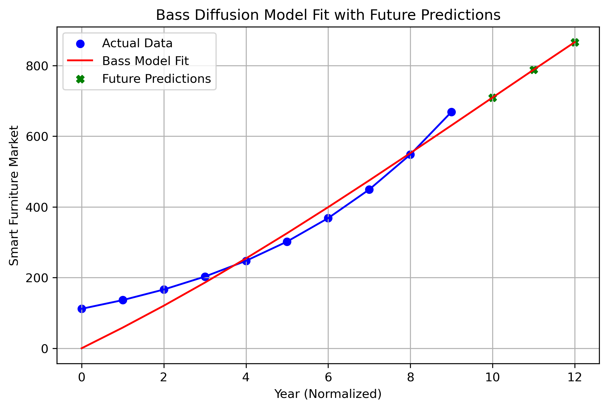
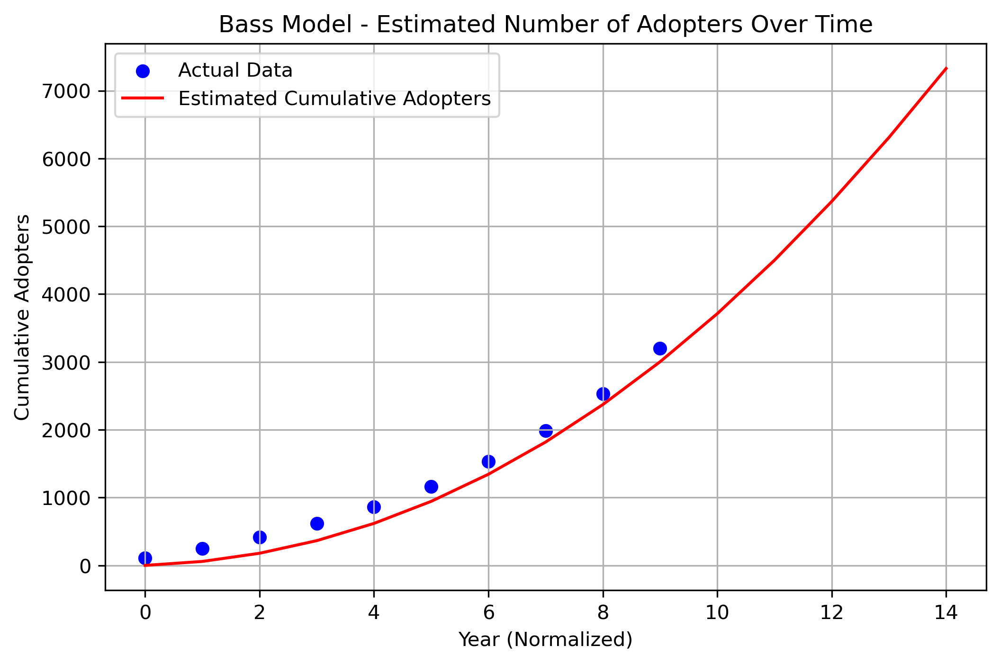

# Project Overview

This repository contains the implementation of **Assignment 1 (DS223: Marketing Analytics)**, focusing on the **Bass Diffusion Model** for innovation adoption.  
The project applies the Bass model to estimate and forecast the diffusion of **Working Smarter — Beflo Tenon Smart Adjustable Desk** from *TIME’s Best Inventions 2024*, using the **Smart Furniture Market (2016–2025)** as a comparable past innovation.

---

## Objectives
- Identify a modern innovation and its historical analog.  
- Collect time-series data representing market adoption.  
- Estimate Bass Model parameters (p, q, M) using historical data.  
- Predict diffusion for the new innovation based on fitted parameters.  
- Interpret results and discuss adoption behavior and market trends.  

---

## Data Sources
Two datasets were used to represent the **global smart furniture and office furniture markets**, providing a realistic proxy for the adoption of the Beflo Tenon Smart Adjustable Desk:

1. **Smart Furniture Market Size Worldwide from 2016 to 2025 (in million U.S. dollars)**  
   Source: Statista (2024)  
   Available at: [https://www.statista.com/statistics/1069616/smart-furniture-market-size-worldwide/](https://www.statista.com/statistics/1069616/smart-furniture-market-size-worldwide/)

2. **Revenue of the Office Furniture Market Worldwide in 2024, by Country (in million U.S. dollars)**  
   Source: Statista (2024)  
   Available at: [https://www.statista.com/forecasts/758649/revenue-of-the-office-furniture-market-worldwide-by-country](https://www.statista.com/forecasts/758649/revenue-of-the-office-furniture-market-worldwide-by-country)

These datasets were used for estimating market adoption patterns and forecasting future diffusion trends using the Bass Model.

---

## Images Directory Description

- **bass_model_fit_with_cumulative_adopters.png** – Bass model fit plot comparing actual and predicted cumulative adopters over time.  
- **bass_model_fit_with_future_predictions.png** – Bass model fit plot with future predictions for the next three years.
- **top10_countries_smart_furniture_revenue_2024.png** – Bar chart showing the top 10 countries by office furniture revenue in 2024. 
- **Beflo-desk.png** – Image of the **Beflo Tenon Smart Adjustable Desk**, showcasing its sleek design and innovative features.  
- **Jervis-desk.png** – Image of the **Jarvis Bamboo Standing Desk**, representing ergonomic and sustainable smart furniture.   
- **Uplift-desk.png** – Image of the **UPLIFT Standing Desk**, illustrating ergonomic advancement in sit-stand desks.

All generated plots and visualizations are stored automatically in the `img/` folder after running the notebook.

---

## Methodology

The project applies the **Bass Diffusion Model**, which describes how new products get adopted in a population. It is governed by three parameters:

- **p (Coefficient of Innovation)** – represents external influence such as marketing or media.  
- **q (Coefficient of Imitation)** – reflects internal influence such as peer effects or social contagion.  
- **M (Market Potential)** – defines the total possible number of adopters.

Model parameters were estimated using non-linear least squares fitting (`scipy.optimize.curve_fit`).  
The model was used to fit historical market data and forecast future adoption for 2026–2028.

---

## Results and Visualizations


### Bass Diffusion Model Fit with Future Predictions
The Bass model fitting plot compares actual and predicted adoption values of smart furniture from 2016–2025 and forecasts market diffusion for three additional years. The predicted trend indicates continued growth and steady adoption driven by imitation effects.



---

### **Adopters Plot: Actual vs. Predicted**
This line plot shows the **actual number of adopters** versus the **predicted number of adopters** for the smart furniture market. The comparison highlights how the Bass Diffusion Model fits the historical data and forecasts future adoption trends.




## Setup Instructions

Follow these steps to reproduce the analysis and results.

### 1. Clone the repository
```bash
git clone https://github.com/AnzhelaDavityan/DS223-HW1.git
cd DS223-HW1
```
### 2. Create a virtual environment  
It is recommended to use a virtual environment to isolate dependencies.  
```bash
python -m venv env
source env/bin/activate    # For macOS/Linux
env\Scripts\activate       # For Windows
```
### 3. Install dependencies  
Install all required Python libraries:  
   The key libraries include:  
   - `pandas` – data manipulation and preprocessing  
   - `numpy` – numerical computations  
   - `matplotlib` and `seaborn` – data visualization  
   - `scipy` – Bass Model parameter estimation (`curve_fit`)  
   - `openpyxl` – reading Excel files

4. **Run the Jupyter Notebook**  
   Start Jupyter Notebook in your working directory:  
   ```bash
   jupyter notebook
   ```
   Then open and run all cells in the file:  
   ```
   DS223-HW1.ipynb
   ```
## References

1. **TIME Magazine (2024).** *Best Inventions 2024.*  
   Retrieved from [https://time.com/best-inventions-2024](https://time.com/best-inventions-2024)

2. **Uplift Desk.** *Uplift Desk Official Website.*  
   Retrieved from [https://www.upliftdesk.com](https://www.upliftdesk.com)

3. **Fully.** *Fully Jarvis Standing Desk.*  
   Retrieved from [https://www.fully.com/jarvis-standing-desk.html](https://www.fully.com/jarvis-standing-desk.html)

4. **Beflo (2024).** *Tenon Smart Adjustable Desk.*  
   Retrieved from [https://gobeflo.com/?srsltid=AfmBOoqm_s6s0OFIdccOect8x8dmKdmqI6T0kKwCarZJbqomQP5lru8L](https://gobeflo.com/?srsltid=AfmBOoqm_s6s0OFIdccOect8x8dmKdmqI6T0kKwCarZJbqomQP5lru8L)

5. **Zhao, Y. (2024).** *Internet of Things Technology in Smart Furniture: An Overview.*  
   *Journal of Electrotechnology, Electrical Engineering and Management*, 7(1), 107–112.  
   Retrieved from [https://doi.org/10.23977/jeeem.2024.070114](https://doi.org/10.23977/jeeem.2024.070114)

6. **Statista (2024a).** *Smart Furniture Market Size Worldwide from 2016 to 2025 (in million U.S. dollars).*  
   Retrieved from [https://www.statista.com/statistics/1069616/smart-furniture-market-size-worldwide/](https://www.statista.com/statistics/1069616/smart-furniture-market-size-worldwide/)

7. **Statista (2024b).** *Top 10 Countries by Smart Furniture Revenue (2024).*  
   Retrieved from [https://www.statista.com/forecasts/758649/revenue-of-the-office-furniture-market-worldwide-by-country](https://www.statista.com/forecasts/758649/revenue-of-the-office-furniture-market-worldwide-by-country)

8. **Course Slides (2024).** *DS-223: Bass Model.* [PDF file]. American University of Armenia.

