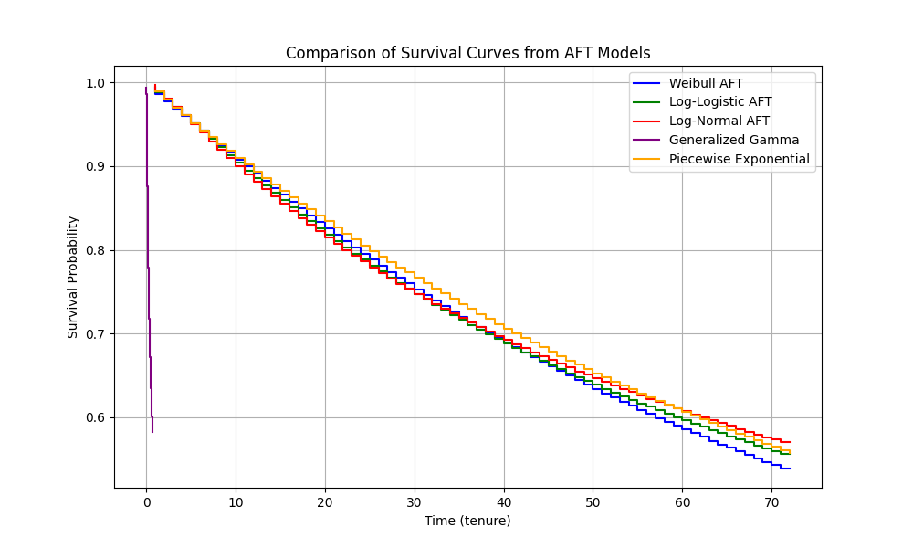

# HW3 - AFT Models for Survival Analysis

## Introduction
In this project, I apply Accelerated Failure Time (AFT) models to predict customer churn using a `telco` dataset. The goal is to model the time to churn and understand which factors influence it. I compare multiple AFT models, including **Weibull AFT**, **Log-Logistic AFT**, **Log-Normal AFT**, **Generalized Gamma Regression**, and **Piecewise Exponential Regression**. The models are compared based on their survival curves and statistical metrics like AIC and p-values.


## Upload The dataset and import required packages
```python
import pandas as pd
import matplotlib.pyplot as plt
from statsmodels.stats.outliers_influence import variance_inflation_factor
from lifelines import (
    WeibullAFTFitter, LogLogisticAFTFitter, LogNormalAFTFitter,
    GeneralizedGammaRegressionFitter, PiecewiseExponentialRegressionFitter,
)
df = pd.read_csv('telco.csv')
```

## Data Preprocessing
The dataset contains customer demographic and usage data, with the target variable being `churn` (whether the customer has churned or not). The preprocessing steps are as follows:
1. **Convert `churn` to binary values**: The `churn` column is converted to binary values (`1` for `Yes` and `0` for `No`).
2. **Encode categorical columns**: I convert categorical variables like `region`, `marital`, `ed`, `retire`, `gender`, `voice`, `internet`, `forward`, and `custcat` into numeric codes using `pd.Categorical`.
3. **One-hot encoding**: For the categorical features, one-hot encoding is applied to create binary columns for each category, except for the first category in each feature (to avoid multicollinearity).

```python
# Convert churn to binary numeric
df['churn'] = df['churn'].map({'Yes': 1, 'No': 0})

# List categorical columns except churn
cat_cols = ['region', 'marital', 'ed', 'retire', 'gender', 'voice', 'internet', 'forward', 'custcat']

for col in cat_cols:
    df[col] = pd.Categorical(df[col]).codes

# Define features and target
X = df.drop(columns=['ID', 'tenure', 'churn'])
y = df['churn']
duration = df['tenure']

X_encoded = pd.get_dummies(X, drop_first=True)

df_model = X_encoded.copy()
df_model['churn'] = y
df_model['tenure'] = duration

duration_col = 'tenure'
event_col = 'churn'
```

## Models
```python
# Weibull AFT model
weibull_aft = WeibullAFTFitter()
weibull_aft.fit(df_model, duration_col=duration_col, event_col=event_col)
print("Weibull AFT model summary:")
print(weibull_aft.summary)

# Log-Logistic AFT model
loglogistic_aft = LogLogisticAFTFitter()
loglogistic_aft.fit(df_model, duration_col=duration_col, event_col=event_col)
print("Log-Logistic AFT model summary:")
print(loglogistic_aft.summary)

# Log-Normal AFT model
lognormal_aft = LogNormalAFTFitter()
lognormal_aft.fit(df_model, duration_col=duration_col, event_col=event_col)
print("Log-Normal AFT model summary:")
print(lognormal_aft.summary)

features = df_model.drop(columns=['tenure', 'churn'])

vif_data = pd.DataFrame()
vif_data["feature"] = features.columns
vif_data["VIF"] = [variance_inflation_factor(features.values, i)
                   for i in range(features.shape[1])]

print(vif_data.sort_values(by='VIF', ascending=False))


# Drop highly correlated features
features_to_drop = ['age', 'custcat']
df_reduced = df_model.drop(columns=features_to_drop)

# Scale duration if needed
df_reduced['tenure_scaled'] = df_reduced['tenure'] / 100

# Generalized Gamma Regression with penalizer and alternate optimizer
gen_gamma_reg = GeneralizedGammaRegressionFitter(penalizer=0.01)
gen_gamma_reg._scipy_fit_method = "SLSQP"

gen_gamma_reg.fit(df_reduced, duration_col='tenure_scaled', event_col='churn')
print(gen_gamma_reg.summary)


# Piecewise Exponential Regression model
piecewise_exp_reg = PiecewiseExponentialRegressionFitter(breakpoints=[10, 20, 30])
piecewise_exp_reg.fit(df_model, duration_col=duration_col, event_col=event_col)
print("Piecewise Exponential Regression model summary:")
print(piecewise_exp_reg.summary)
```
## Plotting


## Comparison 
The comparison between the fitted AFT models shows that most parametric 
curves—Weibull, Log-Logistic, Log-Normal, and Piecewise Exponential—provide 
similar declining survival probabilities across customer tenure, reflecting a 
consistent risk of churn over time. In contrast, the Generalized Gamma model 
exhibits instability at early time points, dropping precipitously, which suggests 
convergence or variance issues in its fit. As a decision maker, the best 
model is not just the one that fits the data closely; it should also yield stable, 
interpretable results, be robust to data issues (like multicollinearity and sample size),
and facilitate actionable business insight.
Based on the comparison of the AFT models, the **Weibull AFT** and **Log-Logistic AFT** models 
appear to be the most appropriate for my data, as both exhibit a strong performance with significant 
coefficients and clear survival curves. The Weibull model shows a sharp decline in survival probability, 
suggesting that it is well-suited for data with a higher risk of failure (or churn) early on. 
Similarly, the Log-Logistic model also captures a rapid decline, allowing for more flexibility in modeling 
changing hazard rates over time. If the data demonstrates distinct phases of risk, the **Piecewise Exponential Regression** 
model would be a good alternative, offering flexibility by modeling different hazard rates for various time intervals. 
However, it is more complex and requires careful handling of the breakpoints. The **Log-Normal AFT** model, 
although it has significant features, shows a smoother survival curve, which may not be as suitable for data with sharp 
transitions in risk. Additionally, the **Generalized Gamma Regression** model encountered convergence issues, making it 
less reliable for your analysis. Therefore, based on the visual curves and model summaries, the **Weibull AFT** and **Log-Logistic AFT** 
are the top contenders for your analysis, with the **Piecewise Exponential Regression** model being a strong alternative for 
data with varying risk over time.

## Best model chosen
```python
# Keep significant features based on p-values (alpha=0.05)
sig_features = weibull_aft.summary[weibull_aft.summary['p'] < 0.05].index.get_level_values('covariate').unique().tolist()
print("Significant features:", sig_features)

final_features = [feat for feat in sig_features if feat in df_model.columns]
df_final = df_model[final_features + ['tenure', 'churn']]

weibull_final = WeibullAFTFitter()
weibull_final.fit(df_final, duration_col='tenure', event_col='churn')

timeline = np.linspace(0, df_final['tenure'].max(), 100)

surv_funcs = weibull_final.predict_survival_function(df_final.drop(columns=['tenure', 'churn']), times=timeline)

expected_lifetime = surv_funcs.sum(axis=0) * (timeline[1] - timeline[0])

# Assume avg revenue per customer per time unit
avg_revenue = 100

clv = expected_lifetime * avg_revenue
df_final = df_final.assign(CLV=clv.values)

```
## Explore CLV within different segments
```python
segment_summary = df_final.groupby(df['region']).CLV.describe()
print(segment_summary)


marital_summary = df_final.groupby(df['marital']).CLV.describe()
print(marital_summary)


custcat_summary = df_final.groupby(df['custcat']).CLV.describe()
print(custcat_summary)


internet_summary = df_final.groupby(df['internet']).CLV.describe()
print(internet_summary)
```
## Analysis
The analysis identified key significant features affecting churn risk, including customer address, age, subscription category (custcat), forwarding service usage, internet subscription, marital status, and voice service. Their coefficients indicate the direction of influence on the expected survival time: positive coefficients (e.g., address, age, custcat) suggest longer expected tenure before churn, while negative coefficients (e.g., forward, internet, marital, voice) indicate higher churn risk.

Examining segments by region, marital status, customer category, and internet subscription reveals important patterns. Regions 0 and 1 show slightly higher average Customer Lifetime Value (CLV), indicating better retention and revenue potential compared to region 2. Married customers have lower average CLV compared to singles, suggesting marital status impacts churn and value. Among subscription categories, customers in category 2 have the highest mean CLV, demonstrating higher value. Importantly, internet subscribers tend to have lower CLV, indicating higher churn risk or lower retention in this segment.

Value, in this context, is defined by the combined measure of customer retention probability and revenue potential. Assuming these data represent the population, an annual retention budget should prioritize at-risk customers identified by survival probabilities below a critical threshold within one year. Retention efforts should focus on segments with lower CLV but high potential impact if saved. Suggested strategies include personalized engagement for high-risk groups, targeted promotions based on service usage, and enhanced service quality improvements, particularly for internet and voice services which significantly influence churn. Continuous monitoring and model updating will help dynamically optimize retention investments.
